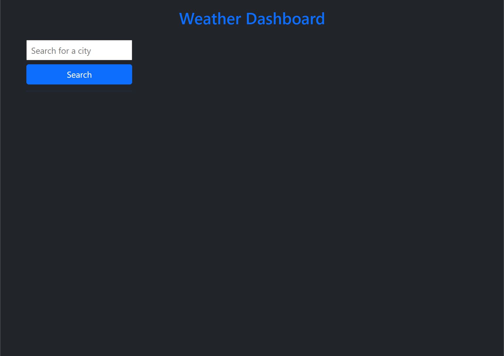
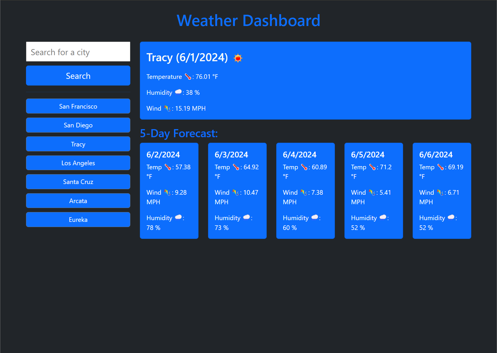
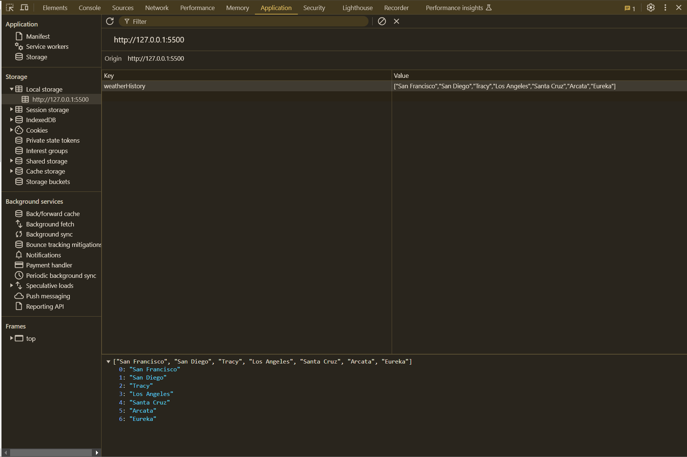

# 06-Module-06-weather-dashbored
a weather dashboard that will run in the browser and feature dynamically updated HTML and CSS.

## Overview
This project is a weather dashboard application that runs in the browser and features dynamically updated HTML and CSS. The application retrieves weather data from the OpenWeather API and displays both current and future weather conditions for a specified city.

## Challenge Description
The challenge is to build a weather dashboard that allows users to:

- Search for a city and view its current and future weather conditions.
- Save the searched cities in the search history.
- Retrieve and display weather data using the OpenWeather API.

## Usage
1. **Search for a City:** Enter the name of the city in the search bar and click the search button.

2. **View Current Weather:** The current weather conditions including city name, date, weather icon, temperature, humidity, and wind speed will be displayed.

3. **View 5-Day Forecast:** The 5-day weather forecast will be displayed with the date, weather icon, temperature, wind speed, and humidity.

4. **Search History:** The searched cities will be saved in the search history. Clicking on a city in the search history will display its current and future weather conditions.

## Deployed Link
https://pauleerama93.github.io/06-Module-06-weather-dashbored/

## Screenshots

 - Home Page Dashboard

 - 5Day Forecast

 - Terminal View 

## Credits
**OpenWeather API:** The weather data is retrieved from the OpenWeather API. Link: https://openweathermap.org/

I would like to extend my deepest gratitude to my teachers, Drew and Kyle, for their invaluable guidance and support throughout the development of this module. Their expertise and encouragement were instrumental in helping me navigate the challenges and successfully complete this project.

A special thanks to Drew for his speed runs, which were exceptionally helpful in understanding the concepts and techniques required to optimize performance and efficiency.

Thank you both for your dedication to teaching and for inspiring me to achieve my best.
